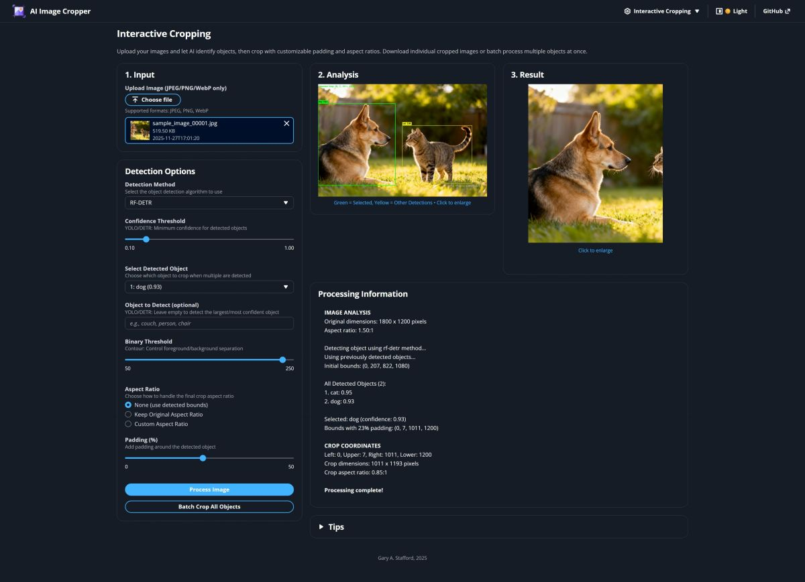
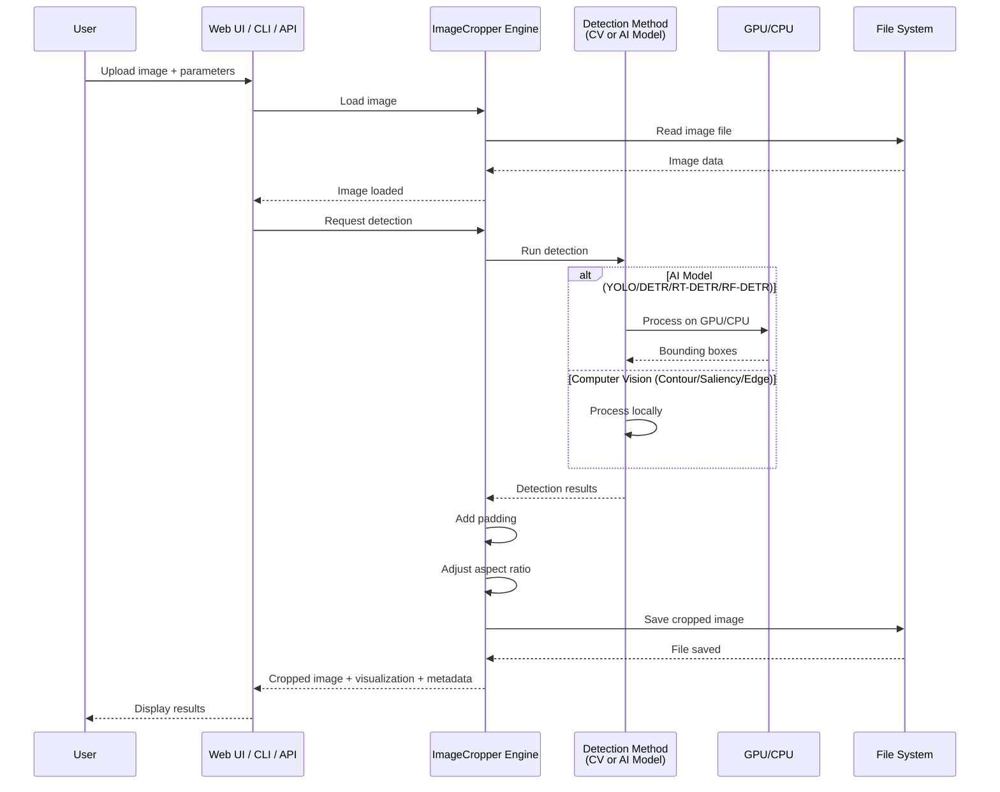

# AI Image Cropper Version 2.0

[](https://github.com/garystafford/ai-image-cropper-v2/actions)
[](https://www.python.org/downloads/)
[](https://opensource.org/licenses/MIT)
[](https://github.com/psf/black)
[](https://github.com/astral-sh/ruff)

Intelligent image cropping tool with multiple detection methods including You Only Look Once (YOLO), DEtection TRansformer (DETR), Real-Time DEtection TRansformer (RT-DETR), Roboflow DETR (RF-DETR), and traditional computer vision algorithms. Available as both a React web interface and a command-line tool. See the blog post, [Enhanced AI-Powered Smart Image Cropping Workflow v2](https://garystafford.medium.com/enhanced-ai-powered-smart-image-cropping-workflow-v2-81aa593fb5bf) for more details.



## Features

### Detection Methods

- **RF-DETR** - Roboflow DETR, highly accurate detection
- **RT-DETR** - Real-time DETR with faster inference and similar accuracy
- **DETR** - State-of-the-art transformer-based detection
- **YOLO** - Fast and accurate deep learning (recommended)
- **Contour** - Fast, works well with clear backgrounds
- **Saliency** - Identifies visually interesting regions
- **Edge** - Canny edge detection
- **GrabCut** - Foreground/background segmentation

### Capabilities

- 🎯 **Object Detection**: Detect specific objects (person, car, couch, etc.)
- 📐 **Custom Aspect Ratios**: Set target aspect ratios (16:9, 4:3, 1:1, custom)
- 🔲 **Smart Padding**: Add breathing room around detected objects
- 🎨 **Batch Processing**: Crop all detected objects individually
- 🖼️ **Multiple Formats**: JPEG, PNG, WebP support
- 🌐 **Web UI (User Interface)**: Modern React interface with AWS Cloudscape Design
- ⌨️ **CLI (Command-Line Interface)**: Full command-line interface for automation
- 🖥️ **Cross-Platform**: Windows, macOS, and Linux support
- ⚡ **GPU Acceleration**: NVIDIA CUDA GPU acceleration or CPU fallback

## Request/Response Flow



The swimlane diagram shows the request/response flow from user input through the system layers: the user interface accepts the request, the ImageCropper engine coordinates processing, detection methods (computer vision or AI models) run on GPU/CPU, and results flow back through the layers to the user.

## Quick Start

### NVIDIA GPU-based Installation

**Prerequisites:** NVIDIA GPU with [CUDA 12.1 drivers](https://www.nvidia.com/Download/index.aspx), Python 3.12+, [uv package manager](https://docs.astral.sh/uv/)

```bash
# 1. Install uv (if not installed)
# Windows:
powershell -ExecutionPolicy ByPass -c "irm https://astral.sh/uv/install.ps1 | iex"
# macOS/Linux:
curl -LsSf https://astral.sh/uv/install.sh | sh

# 2. Clone and install dependencies (includes GPU-enabled PyTorch)
git clone https://github.com/garystafford/ai-image-cropper-v2.git
cd ai-image-cropper-v2
uv sync

# 3. Test GPU detection
# Windows:
.venv\Scripts\activate
python test_gpu.py

# macOS/Linux:
source .venv/bin/activate
python test_gpu.py

# 4. Run detection
python -m backend.cropper sample_images/sample_image_00001.jpg --method rf-detr
```

**Note:** On first run, AI models automatically download (~200MB-1.4GB depending on method). PyTorch with CUDA support is automatically installed via the CUDA repository configured in `pyproject.toml`.

### CPU-Only Installation (No GPU)

If you don't have an NVIDIA GPU, you can manually install the CPU-only version after running `uv sync`:

```bash
# First run normal sync
uv sync

# Then override with CPU-only PyTorch
uv pip install --force-reinstall torch torchvision --index-url https://download.pytorch.org/whl/cpu
```

**Note:** CPU inference will be significantly slower (~3-5x) than GPU-accelerated inference.

## Web UI (optional)

```bash
cd frontend && npm install && cd ..
uvicorn backend.api:app --reload  # Terminal 1
cd frontend && npm run dev         # Terminal 2 - Opens http://localhost:5173
```

## Usage

The AI Image Cropper provides two different interfaces to suit your needs:

### 1. Command-Line Interface (CLI)

The CLI provides full automation capabilities for batch processing and scripting.

#### Basic Usage

```bash
# Using entry point (recommended)
uv run crop-cli image.jpg --visualize --crop-output output.jpg

# Or directly with Python (from root directory)
python -m backend.cropper image.jpg --visualize --crop-output output.jpg
```

#### Single Object Detection

```bash
# Detect and crop a couch with custom aspect ratio
uv run crop-cli living_room.jpg --method yolo --object couch --aspect-ratio 16:9 --crop-output couch.jpg

# Detect person with RT-DETR (faster than DETR)
uv run crop-cli photo.jpg --method rt-detr --object person --confidence 0.5 --padding 10 --crop-output person.jpg

# Detect person with RF-DETR (highly accurate)
uv run crop-cli photo.jpg --method rf-detr --object person --confidence 0.5 --padding 10 --crop-output person.jpg

# Detect person with DETR, add padding
uv run crop-cli photo.jpg --method detr --object person --confidence 0.8 --padding 10 --crop-output person.jpg

# Use contour detection with visualization
uv run crop-cli product.jpg --method contour --threshold 200 --padding 5 --visualize
```

#### Batch Processing

Batch processing automatically crops all detected objects and saves them separately:

```bash
# Detect and crop all people in a family photo
uv run crop-cli family.jpg --method yolo --batch-crop --batch-output-dir ./people

# Batch crop with RT-DETR for faster processing
uv run crop-cli room.jpg --method rt-detr --batch-crop --confidence 0.5

# Batch crop with custom aspect ratio and padding (DETR)
uv run crop-cli room.jpg --method detr --batch-crop --aspect-ratio 4:3 --padding 15

# Batch crop all objects (no specific object filter)
uv run crop-cli scene.jpg --method yolo --batch-crop --confidence 0.7
```

#### CLI Options

```text
positional arguments:
  image_path            Path to the input image

options:
  --method              Detection method: contour, saliency, edge, grabcut, detr, rt-detr, rf-detr, yolo
  --object              Target object(s) to detect (can specify multiple times)
  --confidence          Confidence threshold for deep learning methods (0-1, default: 0.7)
  --keep-aspect         Maintain original aspect ratio
  --aspect-ratio        Custom aspect ratio (e.g., 16:9, 4:3, 1.5, 2.35:1)
  --padding             Padding percentage around object (default: 5)
  --threshold           Threshold value for contour detection (default: 240)
  --visualize           Display detection visualization window
  --crop-output         Save cropped image to specified path
  --batch-crop          Crop all detected objects individually (YOLO/RT-DETR/DETR only)
  --batch-output-dir    Output directory for batch crop (default: cropped_images)
  --image-quality       JPEG quality for saved images (1-100, default: 95)
  --debug               Save debug images during processing
```

### 2. React Web Interface (AWS Cloudscape)

The React UI provides a modern, professional interface using AWS Cloudscape Design System.

#### Prerequisites

- Node.js 18+
- Backend and frontend dependencies installed (see [Quick Start](#quick-start))

#### Start React App

You need to run both the backend API and the frontend development server:

**Terminal 1 - Backend API:**

```bash
# From project root
uvicorn backend.api:app --reload
```

The API will start on `http://localhost:8000`

**Terminal 2 - Frontend Dev Server:**

```bash
# From project root
cd frontend
npm run dev
```

The UI will start on `http://localhost:5173` (or next available port)

#### Using React UI

The React UI provides a modern, professional interface with AWS Cloudscape Design:

1. Upload images via drag-and-drop or file picker
2. Select detection method and configure parameters
3. View real-time processing with visual feedback
4. Download individual crops or batch process multiple objects
5. See detailed processing information and statistics

For detailed React UI documentation, see [frontend/README.md](frontend/README.md).

#### Production Build

To create an optimized production build:

```bash
cd frontend
npm run build
```

The build output will be in `frontend/dist/` and can be served by any static file server.

## Configuration

### Dependencies (pyproject.toml)

Project dependencies are managed in `pyproject.toml`. Common dependency management commands:

```bash
# Add a new package
uv add package-name

# Add a dev dependency
uv add --dev package-name

# Remove a package
uv remove package-name

# Update all dependencies
uv lock --upgrade

# Update a specific package
uv lock --upgrade-package package-name

# Sync environment with lock file
uv sync

# List installed packages
uv pip list

# Show outdated packages
uv pip list --outdated
```

### Application Settings (backend/config.py)

All default values are stored in `backend/config.py` for easy customization:

```python
# UI Display Settings
UI_IMAGE_HEIGHT = 400           # Height for input/visualization images
UI_RESULT_MAX_HEIGHT = 400      # Max height for result image (prevents very tall images)

# Processing Defaults
DEFAULT_CONFIDENCE = 0.5
DEFAULT_PADDING = 8
DEFAULT_THRESHOLD = 240

# Detection Method Defaults
DEFAULT_YOLO_CONFIDENCE = 0.5
DEFAULT_RTDETR_CONFIDENCE = 0.5     # RT-DETR
DEFAULT_CONFIDENCE_THRESHOLD = 0.7  # DETR
DEFAULT_GRABCUT_MARGIN = 0.1        # GrabCut initial rectangle margin
DEFAULT_GRABCUT_ITERATIONS = 5      # GrabCut iteration count
WARMUP_IMAGE_SIZE = 100             # YOLO model warmup image size

# Model Paths
RTDETR_MODEL_NAME = "PekingU/rtdetr_r101vd_coco_o365"

# Batch Processing
BATCH_OUTPUT_DIR = "cropped_images"
BATCH_IMAGE_QUALITY = 95

# Server Settings
SERVER_HOST = "127.0.0.1"
SERVER_PORT = 7860
```

## Tips

- **YOLO** is the fastest and most accurate for common objects
- **RT-DETR** offers a balance between speed and accuracy, faster than DETR with similar results
- **RF-DETR** provides highly accurate detection
- **DETR** provides detailed object detection but is slower than YOLO, RT-DETR, and RF-DETR
- For best results, use padding of 5-10%
- Batch mode works only with YOLO, RT-DETR, and DETR methods
- Common detectable objects: person, car, couch, chair, dog, cat, bottle, laptop, bicycle, etc.
- Use `--visualize` in CLI to preview detection before cropping

## Troubleshooting

### Image Format Error

Ensure your image is JPEG (.jpg, .jpeg), PNG (.png), or WebP (.webp)

### Model Download on First Run

YOLO, RT-DETR, and RF-DETR will download their model files on first use (may take 2-5 minutes for YOLO v12 X-Large, 2-5 minutes for RT-DETR, 5-10 minutes for RF-DETR Large ~1.4GB)

### DETR/RT-DETR/RF-DETR Memory Usage

DETR, RT-DETR, and RF-DETR require more memory than YOLO. RT-DETR is more efficient than DETR. RF-DETR requires significant memory due to its model size. For large images or limited memory, consider using YOLO or RT-DETR instead.

### No Objects Detected

- Lower the confidence threshold
- Try a different detection method
- Verify the object name is in the model's vocabulary

## Development

### Code Quality

```bash
# Format code with Black
uvx black .

# Check formatting without applying
uvx black . --check

# Lint with Ruff
uvx ruff check .

# Fix auto-fixable issues
uvx ruff check . --fix

# Format code with Ruff formatter
uvx ruff format .

# Remove unused imports with autoflake
uvx autoflake --remove-all-unused-imports --in-place --recursive backend/

# Build package
uvx hatch build
```

### Environment Management

```bash
# Create/recreate virtual environment
uv venv

# Activate virtual environment
source .venv/bin/activate  # macOS/Linux

.venv\Scripts\activate     # Windows

# Deactivate virtual environment
deactivate

# Clean and reinstall all dependencies
rm -rf .venv uv.lock
uv sync

# Show Python version in use
uv python --version

# List available Python versions
uv python list
```

## Project Structure

```text
ai-image-cropper-v2/
├── backend/                       # Backend Python application
│   ├── __init__.py
│   ├── api.py                     # FastAPI REST API
│   ├── cropper.py                 # Core processing engine + CLI
│   ├── config.py                  # Configuration constants
│   ├── models/                    # YOLO/RF-DETR model files (auto-downloaded)
│   ├── cropped_images/            # Default batch crop output
│   ├── uploads/                   # Uploaded files (API)
│   └── outputs/                   # Processed outputs (API)
├── frontend/                      # React frontend application
│   ├── src/                       # React source code
│   ├── public/                    # Static assets
│   ├── package.json               # npm dependencies
│   ├── vite.config.js             # Vite configuration
│   └── index.html                 # HTML entry point
├── sample_images/                 # Sample images for testing
├── cropped_images/                # Batch crop output (generated)
├── pyproject.toml                 # Python project configuration (uv)
├── .python-version                # Python version (3.12)
├── uv.lock                        # Python dependency lock file
├── .venv/                         # Virtual environment (created by uv)
└── README.md                      # This file
```

## Requirements

- **Python**: 3.12+
- **Package Manager**: [uv](https://docs.astral.sh/uv/)
- **Key Dependencies**:
  - fastapi >= 0.121.0
  - opencv-python >= 4.8.0
  - ultralytics >= 8.0.0 (YOLO)
  - transformers >= 4.30.0 (DETR and RT-DETR)
  - rfdetr >= 1.3.0 (RF-DETR)
  - torch >= 2.0.0
  - numpy >= 1.24.0
  - pillow >= 10.0.0

See [`pyproject.toml`](pyproject.toml) for complete dependency list.

## Why Python 3.12?

This project uses Python 3.12 to ensure compatibility with PyTorch and CUDA 12.1 for GPU acceleration:

- **CUDA 12.1 Support**: PyTorch with CUDA 12.1 has guaranteed compatibility with Python 3.12 (PyTorch 2.1+)
- **GPU Acceleration**: Python 3.13 requires PyTorch 2.5+ for CUDA 12.1 support, which has limited availability
- **Stability**: Python 3.12 provides a stable, well-tested environment for all AI/ML dependencies
- **Cross-Platform**: Ensures consistency between local development, CI/CD pipelines, and Docker deployments

If you're using CPU-only inference, Python 3.13 will work, but we standardize on 3.12 for consistency across all deployment scenarios.

## License

This project is open source and available under the [MIT License](LICENSE).

Copyright (c) 2025 Gary A. Stafford
